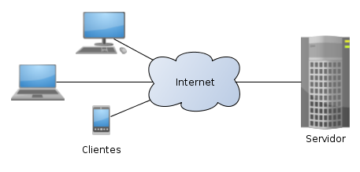
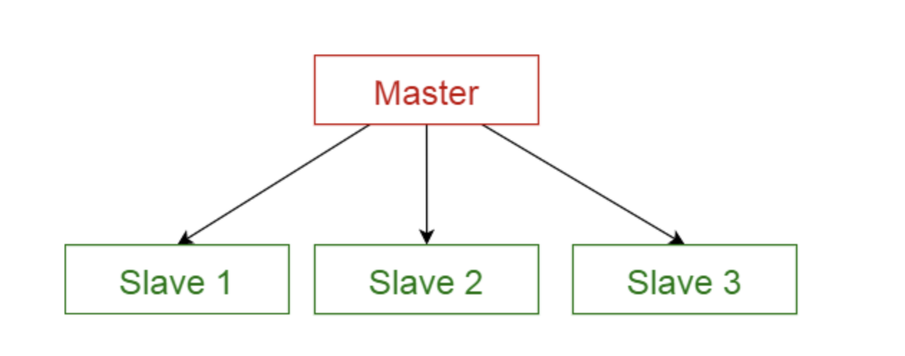
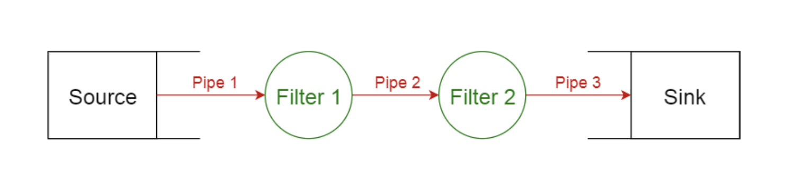
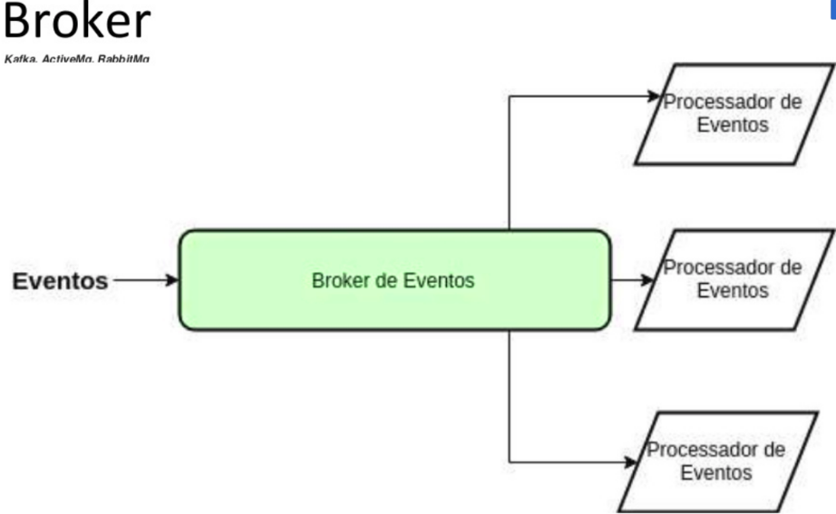
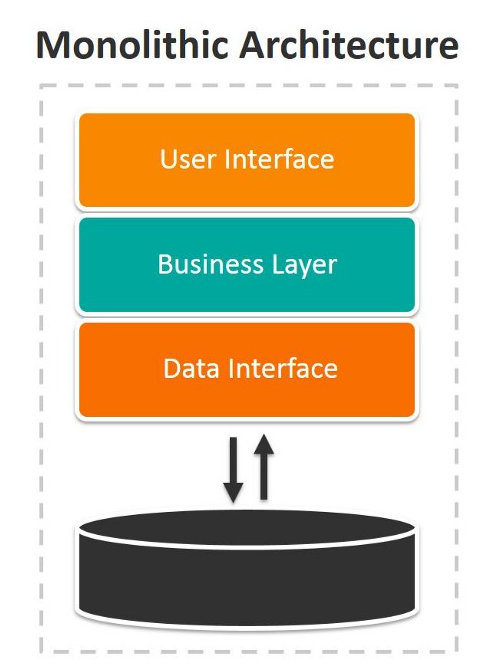
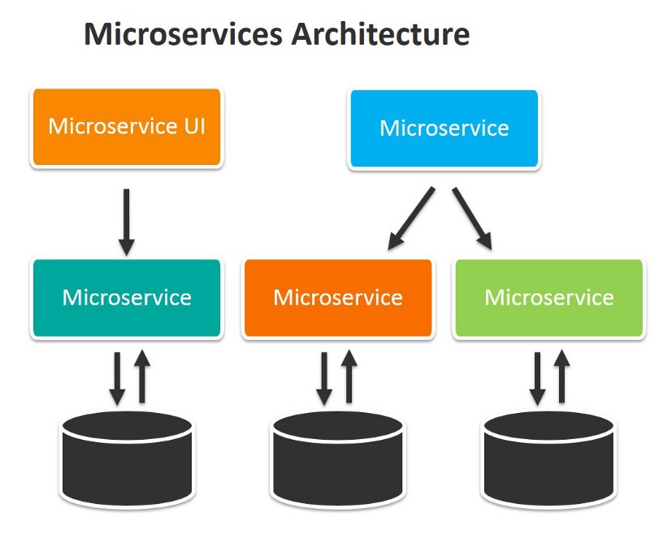

# Arquiteturas de Software

A arquitetura de software de um sistema consiste na definição dos componentes de software, suas propriedades externas, e seus relacionamentos com outros softwares. 

### Mas afinal - O que é um padrão arquitetural?

A definição é simples. Descreve uma solução arquitetural para problemas recorrentes em sistemas de software que se apresentam em contextos específicos.

A solução arquitetural do padrão define:
- as estruturas de software (componentes, serviços, módulos);
- responsabilidades e relações entre essas estruturas;
- formas que as estruturas colaboram para solucionar o problema.

E como você notou existe um *padrão arquitetural*  para isso, não é?

### O que é um padrão arquitetural

Um padrão arquitetural é um conjunto de decisões de projeto de software que define:

- Utilidade;
- tipos de elementos (componentes, serviços, módulos);
- tipos de relações (dependência, colaboração, controle);
- propriedades dos elementos (responsabilidades,funcionalidades), e
- restrições sobre como os elementos se relacionam.

## 1. Padrão em camadas

Este padrão pode ser utilizado na estruturação de programas que são decompostos em grupos de subtarefas, cada um dos quais está em um determinado nível de abstração. Cada camada fornece serviços para a próxima camada superior.

As 4 camadas mais comumente encontradas de um sistema de informação geral são as seguintes:

    * Camada de apresentação (também conhecida como camada de IU)
    * Camada de aplicativo (também conhecida como camada de serviço)
    * Camada de lógica de negócios (também conhecida como camada de domínio)
    * Camada de acesso a dados (também conhecida como camada de persistência)

- Uso
Aplicativos de desktop gerais.
Aplicativos da web de comércio eletrônico.

## 2. Padrão Cliente / Servidor

Esse padrão consiste em duas partes: um servidor e vários clientes . O componente do servidor fornecerá serviços a vários componentes do cliente. Os clientes solicitam serviços do servidor e o servidor fornece serviços relevantes a esses clientes. Além disso, o servidor continua a ouvir as solicitações do cliente.

- Uso
Aplicativos online como e-mail, compartilhamento de documentos e serviços bancários.

## 3. Padrão Master / Slave

Esse padrão consiste em duas partes: mestre e escravos. O componente mestre distribui o trabalho entre componentes escravos idênticos e calcula um resultado final a partir dos resultados que os escravos retornam.

- Uso
Na replicação de banco de dados, o banco de dados mestre é considerado a fonte autorizada e os bancos de dados escravos são sincronizados com ele.

## 4. Padrão Pipeline 

Esse padrão pode ser usado para estruturar sistemas que produzem e processam um fluxo de dados. Cada etapa de processamento é incluída em um componente de filtro. Os dados a serem processados ​​são passados ​​por tubos. Esses canais podem ser usados ​​para armazenamento em buffer ou para fins de sincronização.

- Uso
Compiladores, processamento de dados em massa.

## 5. Padrão Event Driven (Mensageria)

Este padrão é usado para estruturar sistemas distribuídos com componentes desacoplados. Esses componentes podem interagir uns com os outros por invocações de serviço remoto. Um componente corretor é responsável pela coordenação da comunicação entre os componentes. Os servidores publicam seus recursos (serviços e características) para um broker. Os clientes solicitam um serviço do corretor e o corretor então redireciona o cliente para um serviço adequado a partir de seu registro.

- Uso
Software de corretor de mensagens, como Apache ActiveMQ , Apache Kafka , RabbitMQ e JBoss Messaging.

## 6. Padrão Monolito

Uma aplicação monolítica é aquele tipo de aplicação na qual toda a base de código está contida em um só lugar, ou seja, todas as funcionalidades estão definidas no mesmo bloco. Geralmente este bloco é dividido em 3 partes:

Apresentação - Interface do Usuário
Negócio - Camada de processamento
Dados - Banco de dados

- Uso e vantagens do Monolito
    - Simplicidade da arquitetura: Não existem muitas camadas com o que se preocupar
    - Agregação de tecnologia: Toda a aplicação é desenvolvida em uma mesma tecnologia, facilitando a coesão da equipe
    - Fluxo de publicação simples: Alterou? Compilou? É só publicar
    - Rápido desenvolvimento: Por ser uma arquitetura mais simples, o seu desenvolvimento tende a ser muito mais rápido
    - Simples deploy

- Desvantagens
    - Pode gerar acoplamento
    - Se a aplicação crescer de mais, pode gerar dificuldades em manter a mesma
    - Aplicações grandes pode ser de dificil entendimento
    - A aplicação pode se tornar complexa
    - Um bug pode derrubar a aplicação toda
    - Mudanças podem impactar toda a aplicação

## 7. Padrão Microserviços
Explicar o que é uma arquitetura baseada em microserviços é bem simples. Agora, explicar como é a arquitetura de um microserviço é um pouco mais complicado.
Sendo muito pragmático, um microserviço deve ter quatro coisas:

- Alta coesão
- Baixo Acoplamento
- Autonomia
- Independência

Aqui caímos no mito da "alta coesão e baixo acoplamento" que sempre ouvimos nossos professores de computação dizerem quando fazemos alguma matéria relacionada a Engenharia de Software. Veremos isso na última abordagem arquitetural.

- Uso e Vantagens do Microserviço
    - Arquitetura individual simples
    - Facilidade de deploy e testes unitários
    - Sistemas totalmente independentes
    - Serviços coesos e desacoplados
    - Times multidisciplinares completos

Vem comigo mais a diante... Sei o que você deve estar pensando, qual escolher, não é mesmo?

Olha só, essa resposta depende muito do modelo de negócio e dos requistos que precisa atender, com certeza terão arquitetos de sistemas com você que te ajudarão com essas definições mais abrangentes do negócio. É papel deste profissional atender essas necessidades.

Até a próxima galera!!!!